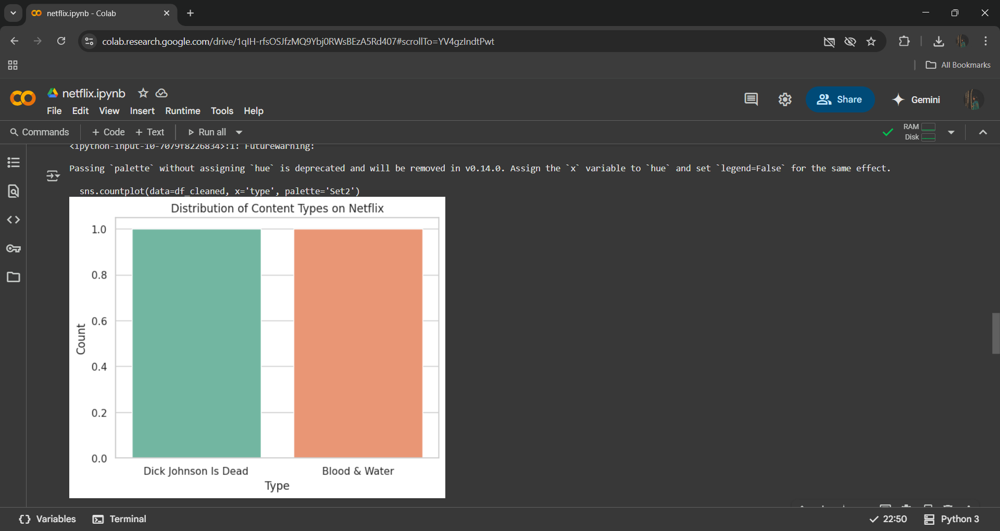
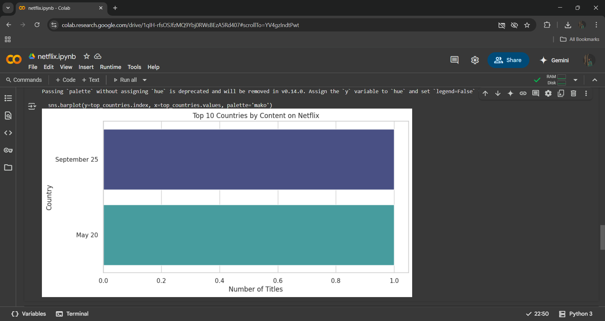
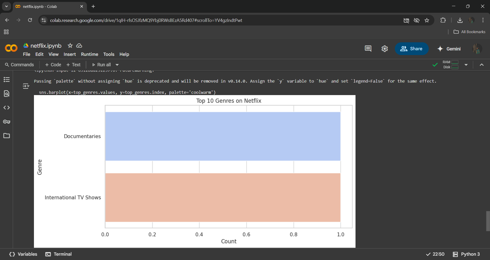

# Netflix User Behavior Analysis

## Project Overview
This project analyzes the Netflix titles dataset to uncover insights about content distribution and trends across countries, genres, and years. It includes data cleaning, exploratory data analysis (EDA), and visualizations using Python libraries such as Pandas, Matplotlib, and Seaborn.

## Dataset
The dataset contains information about movies and TV shows available on Netflix, including titles, types, release years, genres, countries, and dates added.

## Features
- Distribution of content types (Movies vs TV Shows)
- Top countries contributing to Netflix content
- Popular genres on Netflix
- Trend analysis of content added over the years

## How to Run
1. Clone the repository
2. Upload `netflix_titles.csv` to your working directory
3. Open the Jupyter Notebook (`netflix_analysis.ipynb`) in Google Colab or locally
4. Run all cells sequentially to perform analysis and view visualizations

## Technologies Used
- Python
- Pandas
- Matplotlib
- Seaborn
- Jupyter Notebook / Google Colab

## Author
Anjali Kumari

---

## Screenshots

### Distribution of Content Types  

### Top 10 Countries by Content  

### Content Added Over Years  

